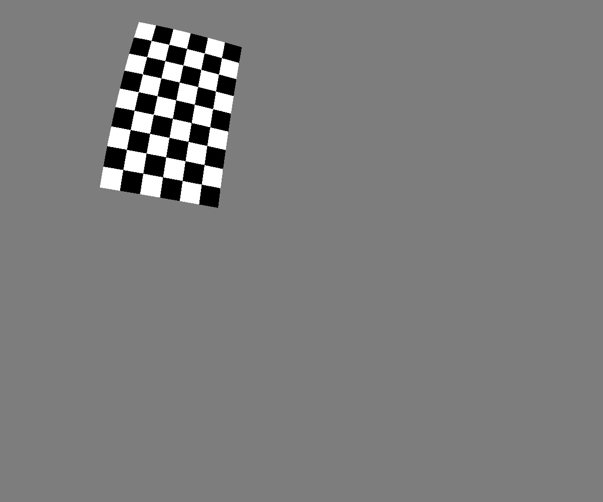
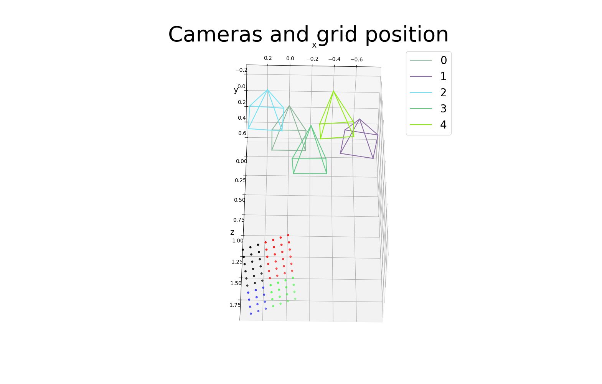
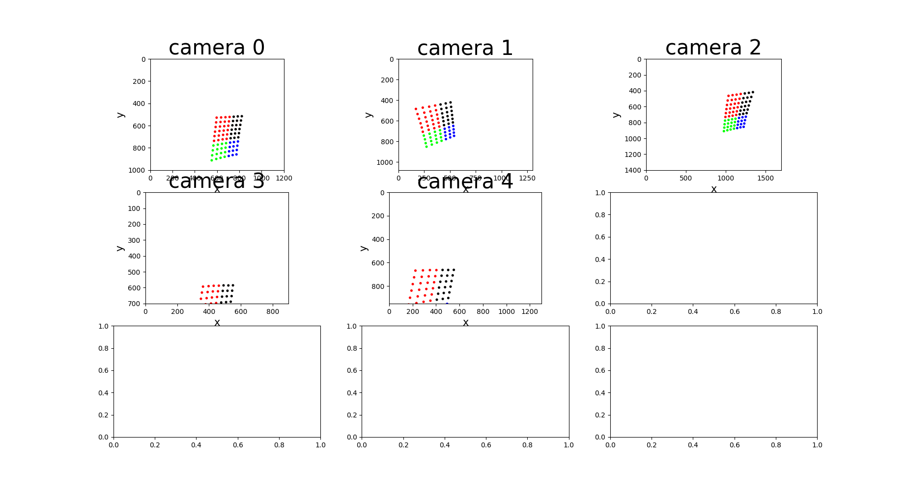

Python project to generate extrinsics, intrinsics, 2D projections, 3D points, and rendered images.
Currently, only checkerboard calibration grid is supported.

How to run
----
Run project by providing the config file:
```console
python3 generate.py --cfg config/demo.yaml
```

Additional arguments:
* `--output_folder`: output folder, default current directory.
* `--save_animation`: 1 -- save animation, otherwise 0.
* `--save_rendering`: 1 -- save rendering, otherwise 0.
* `--export_to_meshlab`: 1 -- save to meshlab file, otherwise 0.

Output:
* In the `output_folder/CFG.NAME/` will be saved calibration data (intrinsics, extrinsics, points) in JSON format. `NAME` is specified in config file.
* If `save_animation` is 1, then in `output_folder/CFG.NAME/animation/` will be saved (1) animation of calibration grid in 3D space with position of cameras, (2) projection of 3D point to each camera.
* If `save_rendering` is 1, then in `export_to_meshlab/CFG.NAME/render/` will be saved rendered images of calibration grid.
* If `export_to_meshlab` is 1, then in `export_to_meshlab/CFG.NAME/meshlab/` will be saved data suitable to import in Meshlab.


|         Rendered image         |
|:------------------------------:|
|  |


|         Camera positions         |
|:--------------------------------:|
|  |


|       2D projections        |
|:---------------------------:|
|  |


Generate new config file using implemented function in config/config.py:
```console
python3 -c "from config.config import generateCircularCameras; generateCircularCameras(save_folder='config/')"
```